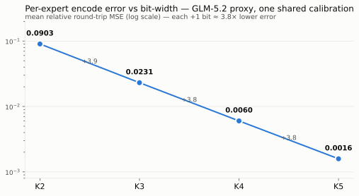
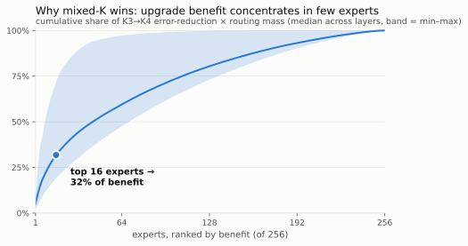
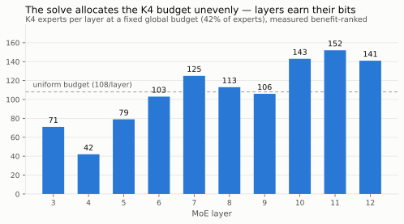

# Progressive Tensors

**Mixed-K quants as a service — assemble your own EXL3 checkpoint from
shared, attested, per-expert segments. Pure safetensors. No new format.**

The community publishes many quantizations of the same MoE model — a flat
3.0 bpw here, a mixed 3.25 bpw there, a 3.42 bpw flagship — each a
multi-hundred-GB download, each an all-or-nothing choice. Progressive
Tensors decomposes them into their real unit of value: **the per-expert
encoded fragment**. One shared K3 base everyone downloads once; per-expert
K4/K5 enhancement fragments fetched (or encoded) as needed; any mix
reassembled into a bootable checkpoint with the recipe *you* choose.

Think progressive JPEG, for quants.

- **Every file is plain safetensors** — readable by any safetensors tool.
  "Progressive" is the fetch/assembly policy *across* files, not a
  container format.
- **Every fragment is content-addressed and signed** — an `fq-attestation/1`
  line pins the fragment's sha256, its source repo at an exact commit, and
  per-expert digests, so any fragment is independently spot-checkable with
  one ranged read. The signing key's authority comes from
  [`keys/FINGERPRINTS`](keys/FINGERPRINTS) **in this git repo**, not from
  the artifact download — see [TRUST.md](TRUST.md).
- **Reassembly is byte-faithful** — assembling the all-K3 recipe from the
  brandonmusic-derived segments reproduces the original checkpoint shards
  **sha256-identical**: re-verified across **all 76 MoE shards** of GLM-5.2
  (layers 3–78; 278.5 GB of expert bytes came from segments, the dense
  layers and embed/head pass through from the source). The full per-quant
  reconstruction proof — byte-identity rungs and measured numeric similarity
  across three community quants, including two different K4 encodes/layouts
  from the same uploader and cross-uploader K3-vs-K4 comparisons — is in
  [docs/RECONSTRUCTION.md](docs/RECONSTRUCTION.md).
- **Fetch only what your recipe uses** — segments are per-expert
  contiguous, so `fq_fetch` HTTP-Range-reads exactly the expert spans a
  recipe names, from one or several publishers, instead of downloading the
  repository.
- **Sharing is deduplicating *within a segment family*** — one published
  set of fragments is one set of bytes, however many recipes reference it,
  and Hugging Face Xet dedupes at chunk level on top. This is a property of
  reusing the *same* fragments, not of the model: two distinct K4 encodes of
  the same expert are different bytes (measured cosine 0.9934 — numerically
  equivalent, byte-wise unrelated), so they do not dedupe against each other
  and never will.
- **Offline tooling, normal checkpoints** — this repository fetches, verifies,
  and assembles normal safetensors checkpoints. A runtime progressive loader
  and live bit-width reallocation are separate experimental work; they are
  not part of this tooling and are not wired as a supported serving workflow.

### Maturity, by component — not one number

- **Segments, assembly and verification: heavily verified, not alpha.**
  Reassembly is sha256-identical on **76/76 MoE shards**; **2048/2048**
  primed expert spans were re-checked against fresh ranged reads of the
  pinned sources; the expanded family was fully re-derived; **184 tests**
  green, on Linux and macOS across Python 3.11–3.13. One live caveat:
  signer-pinned verification *inside* `fq_assemble` has just landed, so
  pass `--trust-signer` explicitly — the tools print the exact line.
- **Runtime: experimental and separate.** The public runtime research is TP
  only and not wired for live reallocation; do not infer a production hot-swap
  path from an assembled checkpoint. The measured topology and SM120 K5 limit
  are documented at immutable revision
  [`69fbef710e558e9cf8e2ad634eccc774f9a806fb`](https://github.com/malaiwah/vllm-voipmonitor/tree/69fbef710e558e9cf8e2ad634eccc774f9a806fb/research/fungible-quant).
- **Artifact repo: public, and still growing.**
  [`malaiwah/GLM-5.2-EXL3-FQ-segments`](https://huggingface.co/malaiwah/GLM-5.2-EXL3-FQ-segments)
  is live. An unattended encode campaign publishes new K2/K5 windows to it,
  so `main` moves: **pin `--revision`/`@<commit>`**, and read layer coverage
  from `fq-manifest.json` `per_k[K].layer_coverage.layers`
  (`fq-layer-coverage/1`). On an older manifest without that field, use the
  signed `index-kK.json` layer keys; `per_k[K].layers` is legacy extrema, not
  sparse-coverage authority.
- **Schemas: v1, versioned, not frozen** — additive changes only, freezing
  once CI and verification have been exercised against published artifacts
  ([`schemas/`](schemas/)).

## The numbers behind it

<picture><source media="(prefers-color-scheme: dark)" srcset="assets/eps-ladder-dark.svg"></picture>

<picture><source media="(prefers-color-scheme: dark)" srcset="assets/benefit-concentration-dark.svg"></picture>

<picture><source media="(prefers-color-scheme: dark)" srcset="assets/k4-allocation-dark.svg"></picture>

*All three measured on the GLM-5.2-architecture proxy: one sealed 1.05M-token
capture, four hessian-identical encodes (K2/K3/K4/K5) with the sha-pinned
production encoder. The [campaign evidence is pinned to immutable research
revision `69fbef710e558e9cf8e2ad634eccc774f9a806fb`](https://github.com/malaiwah/vllm-voipmonitor/tree/69fbef710e558e9cf8e2ad634eccc774f9a806fb/research/fungible-quant).*

## Quickstart: verify + reassemble

Segments for **GLM-5.2** (from
[`brandonmusic/GLM-5.2-EXL3-TR3-3.0bpw`](https://huggingface.co/brandonmusic/GLM-5.2-EXL3-TR3-3.0bpw)
at pinned commit `9297b9f1`) live at
[`malaiwah/GLM-5.2-EXL3-FQ-segments`](https://huggingface.co/malaiwah/GLM-5.2-EXL3-FQ-segments).

> **Before a large download: serving scope.** The published rank-sliced
> artifacts are usable as-is only at **TP4**. TP1/TP2 need dequantization and
> re-quantization (not a repack); TP8/TP16 are unimplemented; the referenced
> runtime refuses EP and DP > 1. On SM120/Blackwell, K5 can assemble and verify
> but cannot currently serve as a mixed tier. These are runtime limits, not
> validations performed by these offline tools; see the [immutable topology
> report](https://github.com/malaiwah/vllm-voipmonitor/blob/69fbef710e558e9cf8e2ad634eccc774f9a806fb/research/fungible-quant/runs/m5-serve/topology-neutrality.md)
> and [K5 report](https://github.com/malaiwah/vllm-voipmonitor/blob/69fbef710e558e9cf8e2ad634eccc774f9a806fb/research/fungible-quant/runs/m5-serve/k5-shared-memory-limit.md).

**Root tiers and nested families are different provenance chains.**

| Location | Where it came from |
|---|---|
| root **K3** | the shared base: every MoE layer, repacked from the brandonmusic 3.0 bpw quant |
| root **K2 / K4 / K5** | fresh `encode-of` tiers from `zai-org/GLM-5.2`; their exact current coverage is `fq-manifest.json` `per_k[K].layer_coverage.layers` (`fq-layer-coverage/1`), or signed `index-kK.json` keys when the field is absent — never legacy `per_k[K].layers` extrema |
| `sources/willfalco-*` | nested, community-primed families: ranged-read `repack-of` / `derived-from` material over layers 3–10; not the root K4 tier and not a direct `fq_fetch --source` provider |

**Inventory changes.** The artifact-card snapshot at commit `c64a3f60`, measured
2026-08-11 10:07 UTC, was **961.8 decimal GB** total; its source checkpoint
observation was **316.4 decimal GB**. Those are planning observations, not
coverage authority. Derive the current artifact size at the revision you chose:

```bash
python - <<'PY'
from huggingface_hub import HfApi
repo, revision = "malaiwah/GLM-5.2-EXL3-FQ-segments", "<immutable-commit>"
info = HfApi().model_info(repo, revision=revision, files_metadata=True)
print(f"{sum(f.size or 0 for f in info.siblings) / 1e9:.1f} GB")
PY
```

Assembly writes a complete checkpoint, so also download the source checkpoint:
dense layers, attention, embeddings, `config.json`, and safetensors header
order come from it. Plan for source + fetched segments + assembled output.

The following is a literal range-fetch workflow. It obtains the policy before
using it and verifies the **locally signed fetched subset**, not a publisher
release:

```bash
git clone https://github.com/malaiwah/progressive-tensors
cd progressive-tensors
uv venv && uv pip install -e '.[hub]'

ARTIFACT_REPO=malaiwah/GLM-5.2-EXL3-FQ-segments
ARTIFACT_REV=64e582a19a97d87236d98c03da26e1ed2a32be16
RECIPE=recipes/glm52-3.0bpw-all-k3.json
PUBLISHER_SIGNER=a58b7bb79ba58457

# Copy the exact policy from the same immutable artifact revision.
hf download "$ARTIFACT_REPO" "$RECIPE" --revision "$ARTIFACT_REV" \
  --local-dir ./artifact

# fq_assemble needs the original non-expert tensors and header layout.
hf download brandonmusic/GLM-5.2-EXL3-TR3-3.0bpw \
  --revision 9297b9f1d53af5c67cffa01e30cc071a1ff7144b \
  --local-dir ./source-quant

# Inspect bandwidth before fetching; then repeat without --dry-run.
uv run tools/fq_fetch.py --policy "./artifact/$RECIPE" --out ./segments \
  --source "$ARTIFACT_REPO@$ARTIFACT_REV" \
  --trust-signer "$PUBLISHER_SIGNER" --dry-run
uv run tools/fq_fetch.py --policy "./artifact/$RECIPE" --out ./segments \
  --source "$ARTIFACT_REPO@$ARTIFACT_REV" \
  --trust-signer "$PUBLISHER_SIGNER"

# fq_fetch signed these newly materialized subset files. Trust that local
# derived-from signer for verification and assembly; it is not the publisher.
LOCAL_SIGNER="$(python -c \
  'import json; print(json.load(open("segments/fq-manifest.json"))["signer_pubkey"])')"
uv run tools/fq_verify.py --identity --segments ./segments \
  --source ./source-quant --trust-signer "$LOCAL_SIGNER" \
  --json id.json --md id.md
uv run tools/fq_assemble.py --segments ./segments --source ./source-quant \
  --policy "./artifact/$RECIPE" --out ./my-checkpoint \
  --trust-signer "$LOCAL_SIGNER"
(cd ./my-checkpoint && sha256sum -c MANIFEST.sha256)
```

Do **not** run `fq_release.py verify --complete` on that range-fetched subset:
it is not a copied publisher release and has no publisher release envelope.
To verify a publisher release, download its entire signed file set into a
separate empty directory, then pin the publisher signer:

```bash
hf download "$ARTIFACT_REPO" --revision "$ARTIFACT_REV" \
  --local-dir ./publisher-release
uv run tools/fq_release.py verify --dir ./publisher-release --complete \
  --trust-signer "$PUBLISHER_SIGNER"
```

`--complete` fails both for a signed file that is missing and for a local file
that is absent from the envelope. It is deliberately unsuitable for a
selective `hf download --include` tree unless that release envelope describes
exactly that subset.

### Disk-saving assembly (`--reflink`)

If segments and output live on a reflink-capable filesystem (XFS with
`reflink=1`, btrfs), add `--reflink` to `fq_assemble.py`: expert-tensor
bytes are then written with `copy_file_range`, letting the kernel share
extents between the segment files and the assembled shards instead of
storing the same bytes twice — *when alignment permits*.

**Measured on XFS (Ceph RBD, kernel 6.8), assembling real GLM-5.2 shards
twice (plain vs `--reflink`):** byte-identity always held (both outputs
sha256-identical to each other and to the original shards), every expert
region went through `copy_file_range` without a single fallback, and the
reflink run was faster (6.3 s → 3.8 s for three shards) — but **zero extents
ended up shared** (`filefrag -v`: no `shared` flags; identical block usage).
Cause, measured: XFS only shares blocks when source and destination offsets
agree mod 4096, and **0.00 % of expert-tensor bytes are 4K-congruent**
between segment and shard offsets — the canonical per-expert reordering plus
differing safetensors header lengths shift every offset. A positive control
(same syscall, aligned offsets, same filesystem) shared extents immediately,
so the limit is alignment, not the kernel or filesystem.

Caveats that remain true everywhere:

- **Sharing is the kernel's call.** `copy_file_range` silently performs a
  plain (server-side) copy when it cannot remap blocks.
- **Output bytes are always identical** to a non-`--reflink` run — the mode
  changes how bytes move, never what they are. Every region falls back
  automatically to the ordinary copy when `copy_file_range` is unavailable or
  fails (cross-filesystem `EXDEV`, `EOPNOTSUPP`, ...), so it is always safe
  to pass.
- **Local disk space only.** No effect on HF/remote transfer or storage (Xet
  chunk-dedupe covers that side).

Net: treat `--reflink` today as "safe, sometimes faster", not as a guaranteed
space saver. A future `fq-segment/2` could pad per-tensor segment offsets into
4K congruence with the source layout (≤ 4 KB per tensor, sub-1 % overhead) if
extent sharing is worth buying.

## Fetch only what the recipe needs (`fq_fetch`)

`fq_fetch` is the consumer half. Given a recipe and one or more **compatible
FQ artifact** sources, it reads `index-kK.json`, turns the recipe into
per-expert byte spans, coalesces them, and HTTP-Range-fetches exactly those —
into a local segment tree that `fq_assemble` consumes unchanged.

```bash
# A real single-source fetch; use the quickstart above to obtain the policy.
uv run tools/fq_fetch.py --policy ./artifact/recipes/glm52-3.0bpw-all-k3.json \
  --out ./segments \
  --source malaiwah/GLM-5.2-EXL3-FQ-segments@64e582a19a97d87236d98c03da26e1ed2a32be16 \
  --trust-signer a58b7bb79ba58457
```

`--source` is repeatable and ordered only for artifact repositories that
actually publish compatible FQ indexes, attestations, and manifests. The
upstream `willfalco/GLM-5.2-EXL3-TR3-3.36bpw` quant is a valid `fq_prime`
input, but it is **not** an FQ source for `fq_fetch`; its primed
representation is nested in the artifact repository rather than independently
addressable. For compatible sources, the first source carrying an expert at
the required K wins; `--prefer-sha` and `--select providers.json` provide
content-hash and explicit provider selection.

- **Every expert is verified as it lands**, against the signed attestation
  *of the source it came from*, before the file is finalized. One output file
  may legitimately mix publishers; `fq-fetch-report.json` records each
  provider.
- **Resumable.** Interrupt it, re-run the same command. Per-expert progress
  is recorded, partial files resume in place, resumed bytes are re-hashed
  before being trusted, and a changed recipe discards the stale partial rather
  than resuming into it.
- **`--dry-run`** prints ranged bytes vs whole-segment-files vs whole-repo.

### Verify provenance without downloading anything big

The spot check below is for an **original publisher fragment**, not the local
subset that `fq_fetch` materializes. Its index offsets and JSONL signature
must come from the same immutable publisher revision as the `resolve` URL:

```bash
PUBLISHER_REPO=malaiwah/GLM-5.2-EXL3-FQ-segments
PUBLISHER_REV=64e582a19a97d87236d98c03da26e1ed2a32be16
hf download "$PUBLISHER_REPO" index-k3.json \
  attestations/layer-030.k3.jsonl --revision "$PUBLISHER_REV" \
  --local-dir ./publisher-metadata
```

Each `attestations/layer-LLL.kK.jsonl` file is **JSON Lines**. This program
verifies the publisher's signature, derives expert 137's range from that
publisher index, and proves the remote server returned exactly that bounded
span. If `./publisher-release/` contains a complete local publisher tree, it
also performs the equivalent `seek`/bounded `read`; it never reads a full
segment into memory.

```python
import base64, hashlib, json
from pathlib import Path
from urllib.request import Request, urlopen
from nacl.signing import VerifyKey

repo = "malaiwah/GLM-5.2-EXL3-FQ-segments"
revision = "64e582a19a97d87236d98c03da26e1ed2a32be16"
metadata = Path("publisher-metadata")
trusted = "a58b7bb79ba5845716aa6fee7d54e714ef243c2875f23a617e1ef3247c565525"
verify_key = VerifyKey(bytes.fromhex(trusted))

digests = {}
for line in (metadata / "attestations/layer-030.k3.jsonl").open():
    if not line.strip():
        continue
    env = json.loads(line)
    assert env["keyid"] == trusted, f"unexpected signer: {env['keyid']}"
    raw = base64.b64decode(env["payload"])
    verify_key.verify(raw, base64.b64decode(env["signature"]))  # raises if bad
    payload = json.loads(raw)
    if payload["fragment"]["file"] == "layer-030.k3.safetensors":
        digests.update(payload["expert_sha256"])

idx = json.loads((metadata / "index-k3.json").read_text())["30"]
lo, hi = idx["experts"]["137"]
start, size = idx["body_offset"] + lo, hi - lo
end = start + size - 1

# Optional local publisher-tree check: seek, then read exactly size bytes.
local_file = Path("publisher-release") / idx["file"]
if local_file.is_file():
    with local_file.open("rb") as segment:
        segment.seek(start)
        blob = segment.read(size)
    assert len(blob) == size
    assert hashlib.sha256(blob).hexdigest() == digests["137"]

# Remote publisher check: immutable URL and exact HTTP Range response.
url = f"https://huggingface.co/{repo}/resolve/{revision}/{idx['file']}"
request = Request(url, headers={"Range": f"bytes={start}-{end}"})
with urlopen(request) as response:
    assert response.status == 206
    assert response.headers["Content-Range"].startswith(f"bytes {start}-{end}/")
    assert int(response.headers["Content-Length"]) == size
    blob = response.read(size)
    assert response.read(1) == b""
assert len(blob) == size
assert hashlib.sha256(blob).hexdigest() == digests["137"]
```

The attestation `materials` block separately pins the upstream source repo,
commit, and file sha256. A matching source-layout span can be range-checked
there too; the immutable artifact request above proves the published fragment
without an accidental whole-file allocation.

## Prime segments from a community quant (`fq_prime`)

Any published EXL3 mixed quant on Hugging Face can be decomposed into
segments **without downloading its shards**. `fq_prime` fetches each layer
shard's safetensors header with a ranged GET, identifies the per-expert
fragments and their K from the trellis geometry, then range-reads only the
expert bytes it needs (coalesced, paced, resumable):

```bash
# per-expert-layout source (3.36 bpw): pull just the K4 experts
uv run tools/fq_prime.py prime \
  --repo willfalco/GLM-5.2-EXL3-TR3-3.36bpw \
  --revision 8d9aa923a17502675ca23737349b67f2e66bb69d \
  --layers 3-10 --k 4 --out ~/fq-primed/segments-336

# shared-H-layout source (3.42 bpw): emits BOTH families — the verbatim
# shared-h segments (repack-of) and, with --expand, the per-expert expanded
# view (derived-from: shared rows replicated into each expert, an exact,
# byte-preserving expansion)
uv run tools/fq_prime.py prime \
  --repo willfalco/GLM-5.2-EXL3-TR3-3.42bpw \
  --revision ae68c65947efa90bea37308e15421872f124c46d \
  --layers 3-10 --k 3,4 --expand --out ~/fq-primed/segments-342
```

**Measured over layers 3–10 of both quants: 46.6 GB transferred against a
72.2 GB full-download counterfactual.** The two runs are the honest bracket
around what ranged reads buy: the 3.36 bpw source, where only the K4 experts
were wanted, moved 13.7 of 36.0 GB (**62 % saved**, 464 range requests); the
3.42 bpw source, where every expert was wanted, moved 32.8 of 36.1 GB (**9 %
saved**, 254 requests — the residue is headers and non-expert tensors).
**The saving is selectivity, not compression.** Ask for everything and you
transfer everything; the win scales with how much of the repo your recipe
does *not* need.

## Verify a reconstruction (`fq_verify`)

`fq_verify` turns "trust me" into a checkable claim, at two rungs:

```bash
# byte-identity, at the strongest granularity that applies (auto-detected):
#  * local snapshot available -> stream-reassemble every shard from segments
#    and compare sha256 against the source checkpoint
uv run tools/fq_verify.py --identity --segments ./segments \
  --source <source-checkpoint-dir> --json id.json --md id.md

#  * primed-from-remote family -> re-fetch sampled experts with FRESH ranged
#    reads of the pinned source and byte-compare (plus a full local hash of
#    every expert span against the signed attestations)
uv run tools/fq_verify.py --identity --segments ~/fq-primed/segments-336

#  * expanded (derived-from) family -> re-derive every expert from its parent
#    shared-h segment + profile and byte-compare in full, checking the
#    parent sha256 pins
uv run tools/fq_verify.py --identity \
  --segments ~/fq-primed/segments-342/expanded \
  --parent ~/fq-primed/segments-342/shared-h

# numeric similarity (GPU, exllamav3 reference dequant): cosine / relative
# Frobenius error / max|diff| between families and against BF16 ground truth
CUDA_VISIBLE_DEVICES=0 python tools/fq_verify.py --similarity \
  --family bm-k3=./segments,k=3 \
  --family 342-k4=~/fq-primed/segments-342/expanded,k=4 \
  --bf16 <bf16-snapshot-dir> --layers 3-10 --experts 24 --seed 42
```

Byte-identity is claimed only where it actually holds — whole shards for a
fully repacked family, per-fragment for a primed layer window, full
re-derivation for expanded views — and everything softer is reported as
measured similarity, not identity. The complete proof table for the three
GLM-5.2 community quants is in
[docs/RECONSTRUCTION.md](docs/RECONSTRUCTION.md).

## Trust: where the key comes from

Signature checking is only as good as the key you check against. Reading
`signer_pubkey` out of the artifact repo's own manifest proves nothing — a
compromised repo rewrites the bytes, the attestations and the key in one
push. So the authorized fingerprints live **in this git repository**:

```bash
cat keys/FINGERPRINTS      # authority derives from the commit history
git log -p keys/FINGERPRINTS   # every key ever authorized, and when
```

Pass one to any tool as `--trust-signer <fingerprint>` (full 64-hex, or an
unambiguous ≥16-hex prefix). Under pinning, a compromised artifact
repository can deny you service — it cannot make you accept the wrong
bytes.

A publisher release additionally publishes **`fq-release/1`**: one signature
over sha256 and size for *every* file, including indexes and attestations.
Verify it only after copying that complete signed release tree:

```bash
uv run tools/fq_release.py verify --dir ./publisher-release \
  --trust-signer a58b7bb79ba58457

# strict: fail if any signed file is absent or any local file is unlisted
uv run tools/fq_release.py verify --dir ./publisher-release --complete \
  --trust-signer a58b7bb79ba58457
```

That closes the gap N per-fragment signatures leave open — they each prove a
fragment's origin, but nothing says *which set of fragments is the release*,
so files could be added, dropped, or rolled back silently. `--complete` makes
"nothing was added" actionable: unlisted files are a **failure**, not a
warning, so it can gate a deploy.

`fq_fetch` instead creates a **derived local subset** with a local signer and
no copied publisher release envelope. Verify it with `fq_verify --identity`
and the local signer from its generated `fq-manifest.json` (as in the
quickstart), then use that same signer for assembly. Running release
verification against it would answer the wrong question and must fail closed.

### Publishing a release atomically

Signing a local tree is only half of it. Uploading it file-by-file — what
every hub client does by default — walks the *published* repository through
a long succession of states that no signature describes, and lets a second
writer interleave commits into the middle of your release.
`fq_release.py publish` does the whole thing as one commit:

```bash
uv run tools/fq_release.py publish \
  --dir ~/fq-segments/GLM-5.2-EXL3-FQ \
  --repo malaiwah/GLM-5.2-EXL3-FQ-segments \
  --release "GLM-5.2-EXL3-FQ 0.1.0" \
  --cache ~/.cache/fq-release-digests.json
```

1. read the remote HEAD and its full file list;
2. hash and sign the release **from the local tree** — the local tree is
   the source of truth, never the host's metadata;
3. push every changed file, every deletion, and `fq-release.json` in ONE
   `create_commit` with `parent_commit=<the HEAD read in step 1>`.

If anyone commits between (1) and (3) the push is **rejected**, not merged:
the tool re-reads, rebuilds and retries within a bounded budget. Only files
whose bytes the remote does not already hold are uploaded, so re-publishing
an unchanged tree costs one small file rather than the repository —
`--cache` keeps a rebuild after a lost race down to a stat() per file.

`publish` also **refuses** when the remote holds release-eligible files the
local tree does not: leaving them would put unsigned files inside a
published release. `--prune` removes them in the same commit;
`--allow-remote-extra` publishes anyway and prints every one.

**What `fq-release.json` does not promise.** It describes *one commit*. A
publisher that ships incrementally — as our own GLM-5.2 campaign supervisor
does, uploading each encode window as it finishes — leaves the branch head
ahead of the last release manifest most of the time. At the release commit
the file list is exact; at `main` there will usually be published segments
newer than, and therefore not covered by, the release manifest, and
`verify --complete` will correctly report them as unlisted — and
`fq-manifest.json`, which every incremental publish rebuilds from the live
inventory, as `MISMATCHED`. A newer manifest and a tampered one look the
same to a signature over an older release, and it should not pretend
otherwise. Nor does it say
anything about freshness: a replayed older release verifies perfectly and
is simply stale, which is why the document carries `release`, `created_utc`
and `parent_revision` for you to compare against what you expected. Pin
`--revision` to a release commit if you want completeness to mean
something.

[**TRUST.md**](TRUST.md) is the full model: the four signature rungs and
three content proofs, what each one does **not** establish, and exactly
what an attacker with full control of the artifact repo can and cannot do
under pinning.

## Contribute segments (encode-and-share)

Fragments nobody has published yet — a K2 fast-load base, a K5 hot-expert
tier, K4 for experts no existing quant covers at that width — can be
encoded by anyone with
the model's BF16 weights and a captured calibration statistic, then
published with `encode-of` provenance: the attestation pins the base model,
the calibration capture, the encoder revision and the effective quant
arguments, so someone else can re-run it.

**With an honest qualifier about determinism.** Re-encoding reproduces the
same bytes only *within a declared stack scope* — same GPU architecture,
same library versions, same batch shapes. We have measured the boundary:
1-ulp differences in CUDA `pow` for rotary `inv_freq`, and row-order
instability in sdpa/grouped_mm across batch shapes, are enough to change
the output. So `encode-of` attestations carry an explicit
`determinism_scope` block, and the honest claim *across* stacks is
`equivalence-of` — measured numeric equivalence — not byte identity. It is
the reproducible-builds model applied where reproducible builds actually
hold, and named differently where they do not.

The encoder driver and capture tooling are documented at the immutable
[research revision `69fbef710e558e9cf8e2ad634eccc774f9a806fb`](https://github.com/malaiwah/vllm-voipmonitor/tree/69fbef710e558e9cf8e2ad634eccc774f9a806fb/research/fungible-quant);
they are not a supported runtime component of this repository.

## Status & roadmap

| Piece | Status |
|---|---|
| Schemas `fq-segment/1`, `fq-attestation/1`, `fq-manifest/1`, `fq-policy/2`, `fq-release/1` | **schema v1 — versioned, not yet frozen**; freezes once CI + verification enforcement have shipped ([`schemas/`](schemas/)) |
| `fq_repack` (checkpoint → segments) / `fq_assemble` (segments+recipe → checkpoint) | working, tested |
| `fq_fetch` (recipe + sources → range-fetched segment tree) | working, tested; multi-source, content-hash selection, resumable |
| Trust root (`keys/FINGERPRINTS`, `--trust-signer`, `fq-release/1`) | working, tested; per-source pinning and DSSE/in-toto envelopes still to come ([TRUST.md](TRUST.md)) |
| Release publication (`fq_release publish`) | atomic: one `create_commit` pinned to the parent HEAD, so a concurrent writer is rejected rather than interleaved; bounded rebuild+retry |
| GLM-5.2 K3 base segments on HF | **published** at [`malaiwah/GLM-5.2-EXL3-FQ-segments`](https://huggingface.co/malaiwah/GLM-5.2-EXL3-FQ-segments), with `LICENSE`, `NOTICE` and a signed `fq-release.json`; reassembly **sha256-verified 76/76 MoE shards** |
| K4 hot-set priming from community mixed quants (3.42/3.36 bpw) | layers 3–10 primed + verified (fragment byte-identity vs fresh source reads — [docs/RECONSTRUCTION.md](docs/RECONSTRUCTION.md)) |
| `fq_verify` (byte-identity + numeric similarity proofs) | working, tested |
| Mixed-size (true mixed-K) assembly + loader metadata | offline assembly is working and tested; serving an output remains subject to the runtime's TP4-only / EP-and-DP refusal and hardware constraints |
| Four tiers in the artifact tree (K2/K3/K4/K5) | root K3 is complete (layers 3–78); root K2/K4/K5 are `encode-of` tiers; nested `sources/willfalco-*` contains community-primed material for layers 3–10. For current coverage, use `per_k[K].layer_coverage.layers` (`fq-layer-coverage/1`) or signed index keys for older manifests; `per_k[K].layers` is legacy extrema only |
| Runtime progressive loader + live bit-width reallocation (vLLM/GG) | separate experimental research, TP-only and not wired as an end-to-end supported workflow; no live-reallocation claim is made by these tools |
| Packaging, CI (ubuntu + macOS, py3.11–3.13), JSON Schemas | landed this release |

## Prior art and positioning

Every ingredient here has prior art, and a commissioned independent review
says so in detail: expert-wise mixed precision (MC-MoE, MxMoE, GEMQ),
progressive/selectable precision (BitStack, Matryoshka Quantization, QStore,
Any-Precision LLM), runtime promotion and demotion of expert precision
(HOBBIT, DynaExq), tensor-aware storage (Git-Theta, HF Xet), signed model
parts (OCI, in-toto, Sigstore/OpenSSF Model Signing). **The contribution is
the integration, not any ingredient.** Runtime promotion in particular is
*not* novel — our angle is being a provenance-aware *source* of the
alternate representations such systems need. The one claim we do make:

> We are not aware of an earlier open system that lets consumers assemble a
> loader-native mixed-K EXL3 safetensors checkpoint from independently
> published, digest-pinned and attested quantization segments.

Full review, with links and a per-layer comparison:
[docs/PRIOR-ART.md](docs/PRIOR-ART.md). The axes we think this should be
judged on are the reviewer's: storage and transfer across *many* recipes
versus separate checkpoints **and** versus Xet dedupe alone; reconstruction
plus verification cost; byte identity; reuse across independently produced
tiers; and multi-provider interoperability.

## Deeper reading

- [TRUST.md](TRUST.md) — the trust model: rungs, what each proves and does
  not, and what a compromised artifact repo can still do under pinning.
- [docs/RECONSTRUCTION.md](docs/RECONSTRUCTION.md) — the measured
  reconstruction proof across three community quants.
- [docs/PRIOR-ART.md](docs/PRIOR-ART.md) — the independent prior-art review.
- [schemas/](schemas/) — every emitted document, with its stability promise.
- [CHANGELOG.md](CHANGELOG.md) — what landed, and the known gaps.

## Research

Design docs, verification reports, and separate runtime research are pinned at
[`malaiwah/vllm-voipmonitor` revision `69fbef710e558e9cf8e2ad634eccc774f9a806fb`](https://github.com/malaiwah/vllm-voipmonitor/tree/69fbef710e558e9cf8e2ad634eccc774f9a806fb/research/fungible-quant)
(`research/fungible-quant/`). Its measured TP4/SM120 environment does not
turn that experimental branch into a supported live-reallocation product.

MIT licensed. Attestation ≠ endorsement: provenance chains terminate at
the source quant's reputation — they make that trust explicit and
checkable, not unnecessary.
